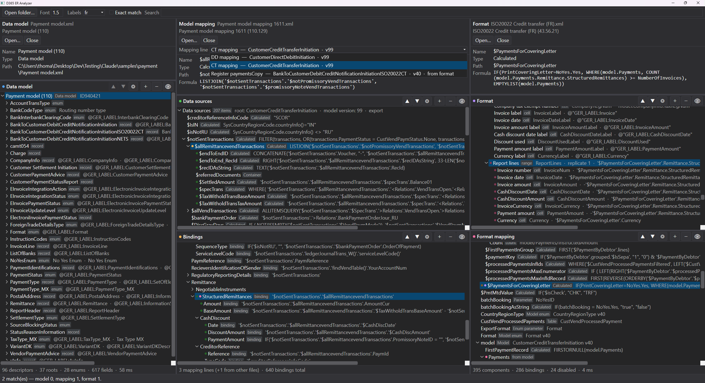

# D365ERAnalyzer

A desktop tool for reading exported **Dynamics 365 Finance & Operations Electronic Reporting (ER)**
configurations side by side, and following a value from a format element back to the table field it
ultimately comes from.

D365 shows a data model, a model mapping and a format one at a time, in separate screens. Answering
"where does this XML element actually get its value?" means holding three trees in your head at once.
This tool puts them in three panes and links them.

---

## Demo



## What it does

**Three panes, five trees.** Data model on the left, model mapping in the middle (split into *Data
sources* over *Bindings*), format on the right (split into *Format* over *Format mapping*). Every
split is independently scrollable and every divider is draggable.

**Follows the resolution chain, both ways.** Right-click a format row for *Find binding in model
mapping*; right-click a binding or a model field for *Find format rows using this*. The trace is
real, not textual — it reads the serialized expression trees and matches on the join key that ER
itself uses.

**Coloured dots instead of guesswork.** Each of the five trees owns a colour. Select a row in the
data sources, bindings, format or format mapping trees and every row it relates to gets that
colour's dot:

- **bright** — the selected row reads this one
- **darkened** — this row reads the selected row

Grouped fields and aggregations take part like any other row, addressed the way formulas actually
reference them. Dots from different trees accumulate, so a row referenced from two directions
carries two dots. Each tree has ▲ ▼ to walk its dotted rows (scroll only — the selection stays put,
so the dot set does not shift under you), ◎ to return to the selection, and 👁 to hide everything
except dotted rows and their context.

The data model tree is deliberately outside this: it is there to be read and searched, not marked.

**Mapping lines from wherever they live.** A model mapping file holds several; a format or a data
model can carry its own. All of them are listed together, each tagged with where it came from, and
the line a loaded format actually consumes is selected automatically. Closing one file leaves the
lines the others contributed.

**Search across all three configurations at once**, with per-tree hit counts, a red border when
nothing matches, and an *exact match* toggle so `$CustTrans` stops dragging in `$CustTrans_OrderBy`.
The data model is searched through an index over the underlying graph, so hits are found in
branches that were never expanded and the tree opens itself to reach them.

**Details panel** per pane showing the selected row's name, type, path, formula and enable
condition — read-only but selectable, with the formula's real line breaks preserved.

**Rows sorted** with `$` and `#` names first, then alphabetically, so the hand-written calculated
fields sit together at the top of each level. The format component tree is the exception and keeps
document order, because that order *is* the output.

**Font multiplier** in the toolbar, applied to the whole window. Defaults to 1.2.

---

## Getting started

Requires the [.NET 8 SDK](https://dotnet.microsoft.com/download) on Windows.

```bash
dotnet run --project src/D365ERAnalyzer
```

Then **Open folder…** and point it at a folder of exported configurations. It reads `*.xml` at the
top level only, identifies each by type, and loads it into the matching pane. If a format and a
model mapping are both present, the mapping line the format actually consumes is selected
automatically. Panes can also be loaded one at a time with **Open…**.

> A folder holding several files of one type loads them all in turn and the last one wins. Point it
> at a folder holding one data model, one model mapping and one format.

The **Font** box next to it multiplies the font size of the whole window; 1 is the WPF default and
the app starts at 1.2.

---

## How to read an ER configuration

The three file types are not independent, and the links between them are the whole point of this
tool. Briefly:

- A **data model** is a flat graph of descriptors, not a tree. The hierarchy exists only by
  resolving each field's type back to another descriptor, and it can be recursive.
- A **model mapping** file holds *several* independent mapping lines. Only one of them is the line a
  given format consumes; the others are for different documents. The line is identified by the
  triple (model GUID, model version, root descriptor).
- A **format** file holds *two* versioned objects: the component tree, and the format mapping that
  binds it. The component tree carries no bindings itself — they are joined in by component GUID.

The full reverse-engineered file structure, including several traps that are easy to get wrong, is
in **[docs/er-xml-schema.md](docs/er-xml-schema.md)**. Worth reading before changing the parser.

---

## Project layout

```
D365ERAnalyzer.sln
docs/er-xml-schema.md          the XML format, reverse-engineered from real exports
src/D365ERAnalyzer/
  Model/                       domain types: descriptors, mappings, bindings, format components
  Parsing/                     XML readers, expression path extraction, the model search index
  ViewModels/                  panes, tree sections, rows, markers
  ViewModels/Panes/            one view model per configuration type
  Views/                       the window, a pane, a tree section
  Converters/                  small value converters
  Themes/Dark.xaml             the shared dark theme, used verbatim
  Themes/Shell.xaml            only what Dark.xaml does not cover
```

Roughly 3 900 lines of C# and 1 000 of XAML. WPF on `net8.0-windows`, MVVM, no third-party
dependencies.

No sample configurations are committed: real exports carry customer data. Point the tool at your
own exports, one data model, one model mapping and one format per folder.

### Notes for anyone changing the parser

- **Resolve from the AST, never from `@ExpressionAsString`.** Every formula is stored twice, and the
  two can disagree — there is a binding in the samples whose display string names `$Amount` while
  its AST names the underlying `SourceTaxAmountCur`. The AST is what runs.
- **`@RelativePath` must be rejoined to its container.** A path interrupted by a function call is
  split in two, and treating the second half as merely relative silently drops every segment after
  the call.
- **Trees are not virtualised.** They measure their full content so the scrollbar is exact and
  scroll-to-row lands precisely; the cost is a real container per expanded row, which is why
  "expand all" stops at 6 000 nodes.

---

## Design decisions

Choices that are not obvious from the code, with the reasoning, so they are not undone by accident.

### Colour identity per section, not per pane

Each of the five trees owns a colour, and a dot on a row says *which tree's selection* refers to it.
Keying on the pane instead looked simpler and was wrong: Format and Format mapping share a pane, so
clicking a row that a Format selection had just marked cleared the mark that put it there. A new
selection clears only its own section's dots, which is what lets marks from two directions coexist
on one row.

Direction is carried by shade rather than a second hue — bright means *the selection reads this
row*, dark means *this row reads the selection*. Five sections in two directions would otherwise be
ten colours to learn.

### Dot navigation scrolls but never selects

▲ ▼ walk the dotted rows; ◎ returns to the selection. They deliberately do not change the selection,
because selecting recomputes which rows are dotted — stepping through the dots by selecting them
would destroy the set being walked. The row the walk stopped on is outlined instead, since nothing
else would show where it is.

### The trees are not virtualised

`ScrollViewer.CanContentScroll="False"`, so the viewer measures the whole expanded content instead
of estimating it. Virtualisation estimates the extent from the rows it has realised so far, which
made the scrollbar resize while scrolling, made scroll-to-row land short, and let recycled
containers carry a stale selection.

The cost is a real container per expanded row, which is why **"expand all" stops at 6 000 nodes**.
That covers every tree in practice — the largest model root expands to 5 151 rows — while stopping
an expand-all on the data model root, which would walk 85 000. If a very large expansion ever feels
slow, this is the trade to revisit.

### The data model is lazy, and search does not depend on the visible tree

The model is a graph that can be recursive, so its tree is built branch by branch with a cycle
guard. That makes a walk of the visible tree useless for searching: it can only find what is already
open. Search instead runs over an index built from the graph — about 1 500 entries, each with a
shortest path from a root — and opens the tree along the path to each hit.

### Selection is per section; the shell remembers all of them

Each tree keeps its own selection, so a pane's details panel shows whichever section was last
touched. Two consequences that need explicit handling:

- Clicking a row that is *already* selected in its own section raises no event, so the left click
  re-announces the row rather than relying on a selection change.
- When one pane rebuilds — switching mapping line, say — the dots cast onto it by *other* panes have
  to be laid down again on the new rows, so the shell keeps every section's live selection.

### Right-clicking does not select

Opening a menu is a question, not a decision. Selecting a row recomputes the dots, the details
panel and the context menus, which is a lot of movement to ask for in passing — so a right-click
outlines the row in grey and builds the menu for it while the selection, the dots and the details
stay exactly where they were.

### The trace menu follows calculated fields; the dots do not

Two resolutions are kept for each format row. The dots use direct references only, so what they
show can be trusted literally. The right-click trace follows calculated fields onwards —
`$FirstPO` → `model/$PurchPurchase` → `model/PurchaseOrderInquiry` — because a jump is a deliberate
question about where a value comes from, and the chain is the answer. One format in the samples
addresses everything through calculated fields, and without this its trace menu would be empty.

### Rows are sorted, except where order is meaning

`$` and `#` names first, then alphabetical. Those prefixes mark fields somebody added by hand,
which is usually what a reader is looking for. The format component tree keeps document order
instead: the sequence of components *is* the emitted document, and sorting it would describe a
file the format never produces.

### Read-only, and resolved from the AST

Nothing is ever written back to a configuration. Every value shown is resolved from the serialized
expression tree, never by parsing the human-readable formula: the two can disagree, and the AST is
what actually runs. See `docs/er-xml-schema.md` §5 and §10.

### The theme file is used verbatim

`Themes/Dark.xaml` is dropped in unchanged so it stays shareable with other tools.
`Themes/Shell.xaml` holds only what it does not cover — menus, splitters, and the templates the
tree and the filter toggle need in order to keep their state visible on hover.

---

## Status

Working tool, developed against several real configuration sets — XML and Excel output formats,
derived and base configurations. Several details of the file format
are decoded empirically rather than from documentation and are marked as unverified in the schema
notes — notably the `@SelectionField` value for a *min* aggregation, which occurs exactly once in
the samples with no name to corroborate it.

Read-only by design: nothing is ever written back to a configuration file.

---

## License

[MIT](LICENSE).
